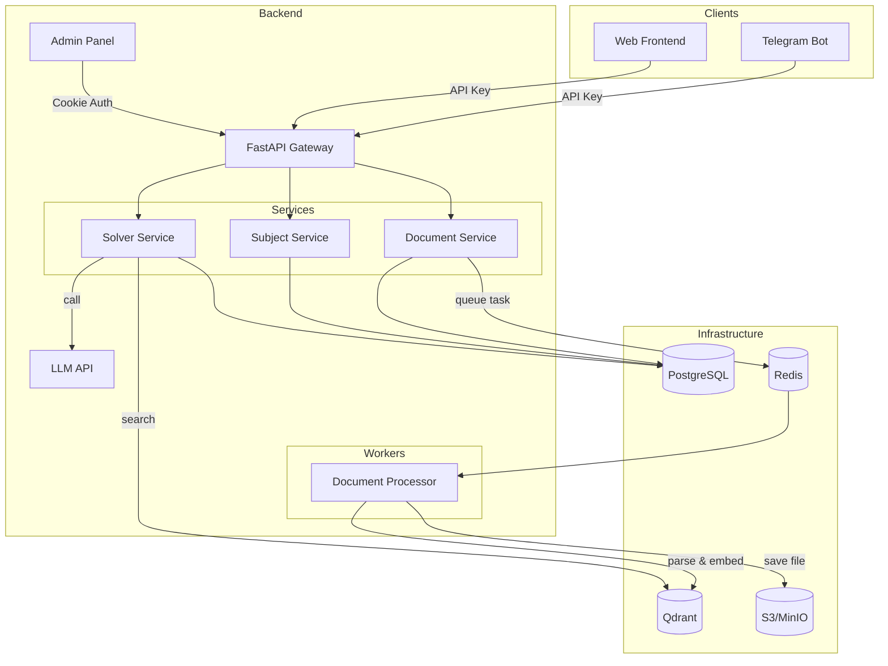
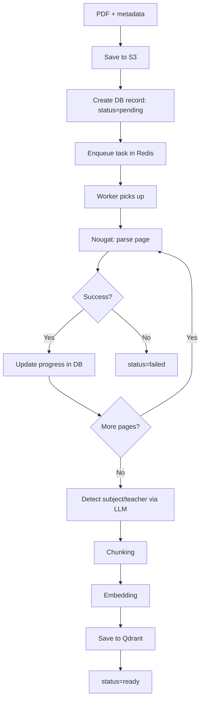
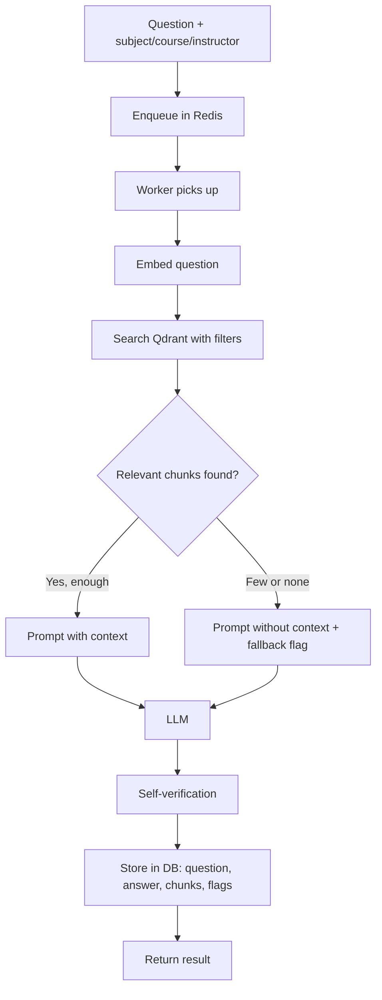
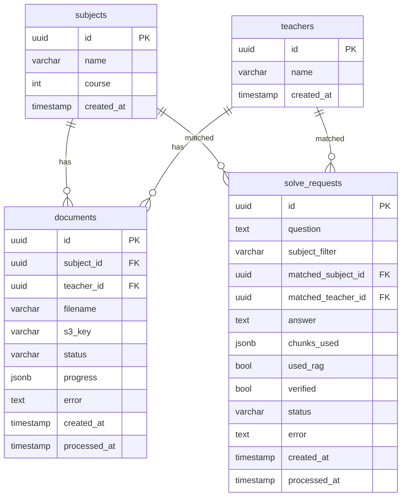

# Project Architecture

Welcome to the architecture overview of the Euler RAG project. This document outlines the high-level design, workflows, data models, and technology stack that power the system.

---

## Table of Contents

- [1. Service Overview](#1-service-overview)
    - [1.1 High-Level System Diagram](#11-high-level-system-diagram)
    - [1.2 Authentication and Access](#12-authentication-and-access)
    - [1.3 Service Responsibilities](#13-service-responsibilities)
- [2. Workflows](#2-workflows)
    - [2.1 Adding a Lecture Note](#21-adding-a-lecture-note)
    - [2.2 Solving a Problem](#22-solving-a-problem)
- [3. Database Schema](#3-database-schema)
- [4. Technology Stack](#4-technology-stack)

---

## 1. Service Overview

### 1.1 High-Level System Diagram

### 1.2 Authentication and Access

- **Clients (Telegram Bot, Web Frontend)** authenticate via API keys.
- **Admin Panel** uses cookie-based session authentication.

### 1.3 Service Responsibilities

- **Document Service**: Accepts PDF files, enqueues processing tasks in Redis, and returns a `task_id`. Worker picks up the task, parses via Nougat, chunks and embeds content, stores vectors in Qdrant, and file in S3.
- **Solver Service**: Receives problem-solving requests, retrieves relevant chunks from Qdrant, crafts prompts with context, sends them to the LLM, and verifies the answer.
- **Subject Service**: Provides CRUD operations for subjects and instructors; used for filtering during search.

---

## 2. Workflows

### 2.1 Adding a Lecture Note

Process Summary:
1. User uploads a PDF and metadata.
2. File is stored on S3 and a pending DB record is created.
3. The task is placed in Redis. The worker processes each page through Nougat.
4. Progress is tracked; after parsing, the subject/teacher is identified via LLM.
5. Chunks are created, embedded, and saved to Qdrant. Status is set to "ready" or "failed."

### 2.2 Solving a Problem

Process Summary:
1. The user sends a request with question and filters.
2. The task is enqueued and picked up by a worker.
3. Question is embedded; Qdrant is searched with applied filters.
4. If enough relevant chunks are found, the LLM is prompted with context; otherwise, fallback behavior applies.
5. Self-verification is performed, full result persisted to DB and returned.

---

## 3. Database Schema

---

## 4. Technology Stack

| Component     | Technology           | Rationale / Features                                                    |
|---------------|---------------------|-------------------------------------------------------------------------|
| Backend       | FastAPI             | Out-of-the-box async, OpenAPI autodoc, type safety with Pydantic        |
| Task Queue    | Celery + Redis      | Python standard, retry/timeout built-in, monitoring with Flower          |
| Database      | PostgreSQL          | JSONB for progress/chunks_used, reliability, familiar ecosystem         |
| Vector DB     | Qdrant              | Fast, metadata filtering, simpler than Pinecone, active development     |
| File Storage  | S3 (boto3)          | Standard API, compatible with any S3 provider                           |
| PDF Parser    | Nougat              | Best open-source for LaTeX, no OCR required                             |
| LLM           | OpenRouter          | Unified API for multiple models, flexible/fallback                      |
| Embeddings    | text-embedding-3-small | Balance of price/quality, 1536 dims                                 |
| Admin Panel   | Jinja2 Templates    | Full UI control, custom dashboards                                      |
| Migrations    | Alembic             | Standard for SQLAlchemy migration                                       |
| Containerization | Docker Compose   | Bring up everything with a single command                               |
